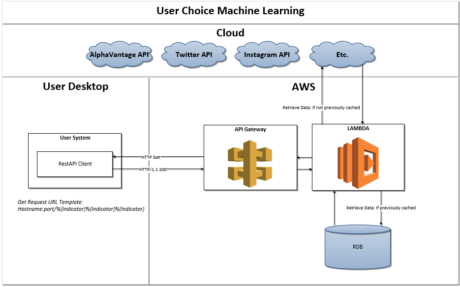

## Portfolio (Click Project Titles for Code!)

---
### Machine Learning

---
[Flappy Bird (Click Me for Code Repository)](https://github.com/njordsoevik/pygame-flappybird)

---
This project combines pygame and artificial nueral networks. To implement reinforcement learning, the algorithm NEAT is used. NEAT (NeuroEvolution of Augmenting Topologies) is an evolutionary algorithm that creates artificial neural networks. Full documentation on the NEAT algorithm can be found at: 
https://neat-python.readthedocs.io/en/latest/

---
[User Choice Machine Learning](https://github.com/njordsoevik/user-choice-machine-learning)

---

Machine learning architecture that allows users to combine their choices of data sources, from Twitter posts to stock market indicators, and receive a trained neural network able to predict stock price movement  
User facing RestAPI built with flask and neural networks optimized and trained with Pytorch. 

High level Visio architecture for this project shown below.

---

---
[Housing Prices](/pdf/housing_nb.html)

---
[Titanic](/pdf/titanic_nb.html)

---
[Digit Recognition](/pdf/digits_nb.html)

---

### Automation

---
[Get Robots](https://github.com/njordsoevik/GetRobots)

---

If you want to scrape a website with a bot/search-engine, you first have to be allowed to scrape the website. Websites lay out the restrictions for which pages these bots/search-engines can reach in their robots.txt file. This script automates the process of searching the robots.txt file for rules applying to my bot/search-engine. 

Before creating this script, I would have to access a website's robots.txt file through a browser, and find my agent in the very large, unorganized robots.txt file. 

[See Facebook's robots.txt file](https://facebook.com/robots.txt)

Instead, I can now run getRobots.py to instantly receive a list of rules for my bot. The below example checks Facebook for which subdomains GoogleBot is allowed.

---

